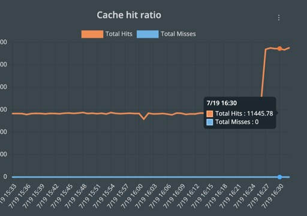

# How to Demo Redis in PDS

## Testing redis on PDS

Need to Demo a few Kubernetes Pods writing data to a Redis Data Service on PDS?
Great, you are in the right place. :) I choose this over a node.js web ui, because I wanted to create some load and scale simulations (even though it is not that much).

1. Deploy a Redis data Service on PDS. For this test it must a single node redis deployment, the redis-py library doesn't handly clustered Redis at this time. Look for a seperate demo for clustered Redis. After the deployment is ready make sure to grab the node name, Username and Password from the Connection link for the Service in PDS.

2. Clone this repo `git clone https://github.com/2vcps/py-redis.git` 

3. Edit `env-secret.yaml` to match your environment. And Apply it to a namespace:
```
kubectl create ns py-redis
kuebctl -n py-redis apply -f env-secret.yaml
```

4. Apply the worker.yaml to create the deployment.
```
kubectl -n py-redis apply -f worker.yaml
```

5. Get the name of your Redis pod, in my case it is `red-jowings-o18106-0`, you can find it in the PDS UI. Replace it in the POD= CLI below.

Verify your dataservice is working. 
```
POD=`kubectl -n pds-demo get pods -l name=red-jowings-o18106 | grep Running | grep 2/2 | awk '{print $1}'`
kubectl -n pds-demo exec -it $POD -- bash
```
From the pod command line:
```
redis-cli

KEYS *
5100) "Colleen"
5101) "Quinton"
5102) "Tonda"
5103) "Marion"
5104) "Cristie"
5105) "Chara"
5106) "Bonny"
5107) "Loris"
5108) "Hee"

GET Hee
"6003"
```
**Type quit then exit to get out of the container bash shell.**

6. You can also scale the worker deployment
```
kubectl -n py-redis scale deployment worker-redis --replicas=16
NAME                            READY   STATUS    RESTARTS   AGE
worker-redis-6fb5c5d7bd-2q2mt   1/1     Running   0          7s
worker-redis-6fb5c5d7bd-6w6wb   1/1     Running   0          6s
worker-redis-6fb5c5d7bd-8hfbw   1/1     Running   0          60m
worker-redis-6fb5c5d7bd-c85b4   1/1     Running   0          7s
worker-redis-6fb5c5d7bd-fxrz4   1/1     Running   0          60m
worker-redis-6fb5c5d7bd-g6xq6   1/1     Running   0          60m
worker-redis-6fb5c5d7bd-g9kjk   1/1     Running   0          61m
worker-redis-6fb5c5d7bd-kfjhb   1/1     Running   0          7s
worker-redis-6fb5c5d7bd-mnzbx   1/1     Running   0          7s
worker-redis-6fb5c5d7bd-n5nzq   1/1     Running   0          60m
worker-redis-6fb5c5d7bd-pjjb8   1/1     Running   0          7s
worker-redis-6fb5c5d7bd-qtc69   1/1     Running   0          7s
worker-redis-6fb5c5d7bd-rldw7   1/1     Running   0          7s
worker-redis-6fb5c5d7bd-rzhjb   1/1     Running   0          60m
worker-redis-6fb5c5d7bd-s2s2c   1/1     Running   0          60m
worker-redis-6fb5c5d7bd-vhr7m   1/1     Running   0          60m
```




Now check your PDS UI for metrics and see if the connections and other graphs have changed.
